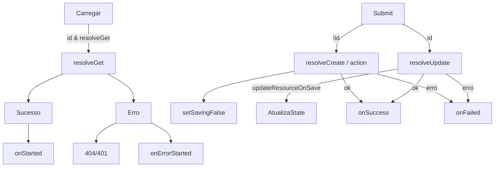

# useViewForm – Documentação Completa

> Um guia prático, rico em exemplos, para integrar, tipar e usar o hook **`useViewForm`** em aplicações React + TypeScript.

---

## 1. Introdução

`useViewForm` é um **super-hook** que combina:

1. Carregamento de dados (por baixo dos panos usa `useView`);
2. Gerenciamento de estado de formulário (criação ✚ e edição ✏️);
3. Validação, tratamento de erros HTTP (404 / 401) e feedback de salvamento;
4. Utilidades para ler/escrever campos aninhados **via _path strings_** - ex.: `"endereco.rua"` ou `"items.0.nome"`.

Ele abstrai todo o fluxo CRUD de tela de formulário, deixando você focar apenas na UI.

---

## 2. API Reference

### 2.1. Tipos genéricos

```ts
useViewForm<DataForm = unknown, IDType = string | number, T extends Record<string, IResolve> = Record<string, IResolve>>(props)
```

* **`DataForm`** Estrutura do recurso editado (ex.: `User`).
* **`IDType`** Tipo do ID (string, number, UUID…).
* **`T`** Mapa opcional de _resolvers_ extras (herdado de `useView`).

### 2.2. Props (`IUseViewFormProps`)

| Prop | Tipo | Descrição |
|------|------|-----------|
| `id?` | `IDType` | Se definido, o hook opera em **modo edição** e dispara `resolveGet`. |
| `firstLoad?` | `boolean` | Executa `resolveGet` automaticamente (padrão: `true`). |
| `resolveGet?` | `IResolve` | Recupera o recurso quando há `id`. |
| `resolveCreate?` | `IResolve<Resp, DataBody>` | Cria novo recurso. |
| `resolveUpdate?` | `IResolve<Resp, [IDType, DataBody]>` | Atualiza recurso existente. |
| `resolveAction?` | `IResolve` | Alias de `resolveCreate` (útil para endpoints genéricos). |
| `updateResourceOnSave?` | `boolean` | Atualiza o estado local com o retorno do *save* (padrão: `false`). |
| `initialData?` | `Partial<DataForm>` | Estado inicial quando não há `id`. |
| `handleInsertForm?` | `(data) ⇒ Partial<DataForm>` | Converte resposta do back-end para formato do form. |
| `handleFormData?` | `(data) ⇒ Body` | Converte dados do formulário antes do *save*. |
| `validateData?` | `(data) ⇒ Record<string,string>` | Validação síncrona ou assíncrona. |
| `onStarted?` | `(resolves) ⇒ void` | Delegado de `useView` (sucesso no *load*). |
| `onErrorStarted?` | `(errors) ⇒ void` | Delegado de `useView` (falha no *load*). |
| `onSuccess?` | `(response, creating) ⇒ void` | Chamado após *save* com sucesso. |
| `onFailed?` | `(error, creating) ⇒ void` | Chamado após *save* com erro. |
| `onErrorData?` | `(errors:string[]) ⇒ void` | Chamado quando `validateData` retorna erro. |
| `resolves?` | `T` | Resolvers adicionais executados junto com `resolveGet`. |
| _…todos os campos herdados de_ **`IUseViewProps`** |

### 2.3. Retorno

| Campo | Tipo | Descrição |
|-------|------|-----------|
| `isEditing` | `boolean` | **`true`** se existir `id`. |
| `isSaving` | `boolean` | `true` durante `submitForm()`. |
| `isNotFound` | `boolean` | `true` se `resolveGet` retornar 404. |
| `isNotAuthorization` | `boolean` | `true` se 401. |
| `resource` | `Partial<DataForm>` | Estado mutável do formulário. |
| `originalResource` | `Partial<DataForm>` | Snapshot imutável do dado carregado. |
| `initialData` | `Partial<DataForm>` | Cópia do `initialData` recebido. |
| `statusInfo` | `IStatusInfo` | Estados de **`useView`** (loading, error…). |
| `resolvesResponse` | `Partial<IResolvedValues<T>>` | Dados dos resolvers extras. |
| **Funções utilitárias** |
| `setField(path, value)` | - | Define um campo aninhado. |
| `getField(path)` | - | Lê um campo aninhado de `resource`. |
| `getOriginalField(path)` | - | Lê de `originalResource`. |
| `setData(data)` / `getData(treatment?)` | - | Manipula o objeto inteiro. |
| `checkErrors()` | `Promise<Record<string,string>>` | Executa `validateData`. |
| `submitForm()` | `Promise<void>` | Cria ou atualiza. |
| `reloadPage(wait1s?)` | `Promise<Resolves>` | Dispara *reload* geral. |
| `setFieldErrors(field, error)` | - | Define erro para um campo específico. |
| `getFieldError(field)` | `string \| undefined` | Obtém erro de um campo específico usando dot notation. |
| `setFieldError(field, error)` | - | Define erro para um campo específico usando dot notation. |
| `clearErrors()` | - | Limpa todos os erros. |
| _e todos os métodos herdados do_ **`useView`** |

---

## 3. Exemplos Rápidos

### 3.1. Criação simples

```tsx
interface UserForm { name: string; email: string; }

export default function NewUser() {
  const {
    resource, setField, submitForm,
    isSaving, checkErrors
  } = useViewForm<UserForm>({
    initialData: { name: '', email: '' },
    resolveCreate: (body) => api.post('/users', body),
    onSuccess: () => toast.success('Usuário criado!')
  });

  return (
    <form onSubmit={e => { e.preventDefault(); submitForm(); }}>
      <input value={resource.name ?? ''} onChange={e => setField('name', e.target.value)} />
      <input value={resource.email ?? ''} onChange={e => setField('email', e.target.value)} />
      <button disabled={isSaving}>Salvar</button>
    </form>
  );
}
```

### 3.2. Edição com `resolveGet` + `resolveUpdate`

```tsx
function EditUser({ userId }: { userId: number }) {
  const {
    resource, setField, submitForm,
    isLoading, isSaving, isNotFound
  } = useViewForm<UserForm, number>({
    id: userId,
    resolveGet   : (id)       => api.get(`/users/${id}`),
    resolveUpdate: (id, body) => api.put(`/users/${id}`, body),
    updateResourceOnSave: true
  });

  if (isNotFound) return <NotFound />;
  if (isLoading)  return <Skeleton />;

  return (
    <>
      <input value={resource.name ?? ''}  onChange={e => setField('name',  e.target.value)} />
      <input value={resource.email ?? ''} onChange={e => setField('email', e.target.value)} />
      <button onClick={submitForm} disabled={isSaving}>Atualizar</button>
    </>
  );
}
```

### 3.3. Validação customizada

```tsx
const emailRegex = /^[^\s@]+@[^\s@]+\.[^\s@]+$/;

const validate = (data: UserForm) => {
  const errors: Record<string,string> = {};
  if (!data.name)  errors.name  = 'Nome obrigatório';
  if (!emailRegex.test(data.email)) errors.email = 'E-mail inválido';
  return errors;
};

useViewForm<UserForm>({
  validateData: validate,
  onErrorData : (errs) => toast.error(errs.join('\n')),
  ...
});
```

### 3.4. Manipulando dados antes de enviar

```ts
handleFormData: (form) => ({
  ...form,
  created_at: new Date().toISOString()
})
```

### 3.5. Campos aninhados

```tsx
// Atualiza o título do primeiro item
setField('items.0.title', 'Primeiro item');

// Lê campo deep-nested
const valor = getField('endereco.cidade.nome');
```

---

## 4. Gerenciamento de Erros

### 4.1. Erros de Validação

O `useViewForm` oferece várias formas de gerenciar erros de validação:

#### Definindo erros manualmente

```tsx
const { setFieldErrors, clearErrors, errors } = useViewForm<UserForm>({
  // ... outras props
});

// Definir erro para um campo específico
setFieldErrors('email', 'Este email já está em uso');

// Definir múltiplos erros
setFieldErrors('name', 'Nome é obrigatório');
setFieldErrors('password', 'Senha deve ter pelo menos 8 caracteres');
setErrors({name: 'Nome é obrigatório', password:  'Senha deve ter pelo menos 8 caracteres'})
// Limpar todos os erros
clearErrors();

// Acessar erros atuais
console.log(errors); // { email: 'Este email já está em uso', name: 'Nome é obrigatório' }
```

#### Usando as novas funções com dot notation

```tsx
const { getFieldError, setFieldError, clearErrors } = useViewForm<UserForm>({
  // ... outras props
});

// Definir erros usando dot notation
setFieldError('user.profile.name', 'Nome do perfil é obrigatório');
setFieldError('address.street', 'Rua é obrigatória');
setFieldError('items.0.title', 'Título do primeiro item é obrigatório');

// Obter erros específicos
const profileNameError = getFieldError('user.profile.name'); // 'Nome do perfil é obrigatório'
const streetError = getFieldError('address.street'); // 'Rua é obrigatória'
const nonExistentError = getFieldError('nonexistent.field'); // undefined

// Limpar erro específico
setFieldError('user.profile.name', ''); // Remove o erro

// Limpar todos os erros
clearErrors();
```

#### Validação automática com `validateData`

```tsx
const validate = (data: UserForm) => {
  const errors: Record<string, string> = {};
  
  if (!data.name) errors.name = 'Nome é obrigatório';
  if (!data.email.includes('@')) errors.email = 'Email inválido';
  
  return errors;
};

const { submitForm, errors } = useViewForm<UserForm>({
  validateData: validate,
  onErrorData: (errorMessages) => {
    // Chamado quando há erros de validação
    toast.error(errorMessages.join('\n'));
  },
  // ... outras props
});
```

#### Limpeza automática de erros

Os erros são **automaticamente limpos** no início de cada `submitForm()`, garantindo que erros antigos não persistam:

```tsx
// Cenário: usuário tem erros de validação
setFieldErrors('name', 'Nome é obrigatório');
console.log(errors); // { name: 'Nome é obrigatório' }

// Ao submeter novamente, erros são limpos primeiro
await submitForm(); // Erros são limpos → validação executa → novos erros (se houver) são definidos
```

#### Exemplo completo com gerenciamento de erros

```tsx
function UserForm() {
  const {
    resource, setField, submitForm, errors,
    setFieldErrors, clearErrors, isSaving
  } = useViewForm<UserForm>({
    initialData: { name: '', email: '' },
    validateData: (data) => {
      const errors: Record<string, string> = {};
      if (!data.name) errors.name = 'Nome é obrigatório';
      if (!data.email.includes('@')) errors.email = 'Email inválido';
      return errors;
    },
    resolveCreate: (body) => api.post('/users', body),
    onSuccess: () => {
      toast.success('Usuário criado!');
      clearErrors(); // Opcional: limpar erros após sucesso
    },
    onErrorData: (errorMessages) => {
      toast.error('Corrija os erros no formulário');
    }
  });

  // Validação customizada em tempo real
  const handleEmailBlur = async () => {
    if (resource.email) {
      try {
        await api.get(`/users/check-email/${resource.email}`);
        // Email disponível - limpar erro se existir
        if (errors.email === 'Email já está em uso') {
          setFieldErrors('email', '');
        }
      } catch {
        setFieldErrors('email', 'Email já está em uso');
      }
    }
  };

  return (
    <form onSubmit={e => { e.preventDefault(); submitForm(); }}>
      <div>
        <input 
          value={resource.name ?? ''} 
          onChange={e => setField('name', e.target.value)}
          placeholder="Nome"
        />
        {errors.name && <span style={{ color: 'red' }}>{errors.name}</span>}
      </div>

      <div>
        <input 
          value={resource.email ?? ''} 
          onChange={e => setField('email', e.target.value)}
          onBlur={handleEmailBlur}
          placeholder="Email"
        />
        {errors.email && <span style={{ color: 'red' }}>{errors.email}</span>}
      </div>

      <button disabled={isSaving}>
        {isSaving ? 'Salvando...' : 'Salvar'}
      </button>
    </form>
  );
}
```

#### Usando com useFormField (Provider Pattern)

O `useFormField` agora utiliza automaticamente as novas funções `getFieldError` e `setFieldError`:

```tsx
function FormFields() {
  const { value: name, setValue: setName, error: nameError, setError: setNameError } = 
    useFormField<UserForm, 'name'>('name', '');
  
  const { value: email, setValue: setEmail, error: emailError, setError: setEmailError } = 
    useFormField<UserForm, 'email'>('email', '');
  
  // Campos aninhados também funcionam
  const { value: street, setValue: setStreet, error: streetError, setError: setStreetError } = 
    useFormField<UserForm, 'address.street'>('address.street', '');

  // Validação customizada
  const handleEmailValidation = async () => {
    if (email && !email.includes('@')) {
      setEmailError('Email deve conter @');
    } else {
      setEmailError(''); // Limpar erro
    }
  };

  return (
    <div>
      <div>
        <input
          value={name}
          onChange={(e) => setName(e.target.value)}
          placeholder="Nome"
        />
        {nameError && <span style={{ color: 'red' }}>{nameError}</span>}
      </div>

      <div>
        <input
          value={email}
          onChange={(e) => setEmail(e.target.value)}
          onBlur={handleEmailValidation}
          placeholder="Email"
        />
        {emailError && <span style={{ color: 'red' }}>{emailError}</span>}
      </div>

      <div>
        <input
          value={street}
          onChange={(e) => setStreet(e.target.value)}
          placeholder="Rua"
        />
        {streetError && <span style={{ color: 'red' }}>{streetError}</span>}
      </div>
    </div>
  );
}
```

---

## 5. Tratamento de Erros HTTP

`useViewForm` já identifica 404/401 provenientes de:

* `axios` (`isAxiosError`);
* `fetch` (`Response`);
* Objetos customizados com `status_code`.

Estados resultantes:

| Flag | Quando fica `true` |
|------|--------------------|
| `isNotFound` | `status === 404` |
| `isNotAuthorization` | `status === 401` |

> Estas flags **NÃO** entram em conflito com `statusInfo.isErrorOnLoad`, podendo ser usadas para renderizar telas 404/401 dedicadas.

---

## 6. Ciclo de Vida Completo



---

## 7. Melhores Práticas

1. **Memoize** resolvers que dependem de `props` com `useMemo`.
2. Use **`handleInsertForm`** para adaptar a resposta da API (e.g. converter datas).
3. Valide **antes** de chamar `submitForm` usando `checkErrors()` caso precise abrir diálogo de confirmação.
4. Prefira **paths tipados** `setField<'endereco.rua'>('endereco.rua', 'Nova Rua');`.
5. Ative `updateResourceOnSave` somente se o back-end devolve a entidade já atualizada.
6. **Use `setFieldErrors`** para validações em tempo real (ex.: verificar disponibilidade de email).
7. **Combine `clearErrors`** com feedback visual para melhor UX após correções.
8. **Desabilite botões de submit** quando há erros: `disabled={Object.keys(errors).length > 0}`.
9. **Aproveite a limpeza automática** de erros no `submitForm` - não precisa limpar manualmente antes.

---

## 8. Troubleshooting

| Sintoma | Causa comum | Solução |
|---------|-------------|---------|
| `submitForm` não faz nada | `validateData` retornou erros | Verifique `onErrorData` ou chame `checkErrors()` manualmente. |
| Loop infinito ao mudar `id` | Dependências erradas em `useEffect` externo | Lembre-se de que o hook já se _resetta_ quando `id` muda. |
| Flags `isNotFound`/`isNotAuthorization` nunca ligam | Erro não tem `status` nem `status_code` | Lance `new Response('', {status:404})` ou use `axiosError.response.status`. |
| Tipos `any` | Resolvers sem retorno tipado | Declare generics de `useViewForm` ou tipagem explícita nos resolvers. |

---

## 9. Conclusão

`useViewForm` centraliza **load → edit → validate → save → feedback** em um único hook:

* Reduz **boilerplate** e **risco de bugs**;
* Mantém **tipagem forte** e **testabilidade** (vide `useViewForm.test.ts`);
* Escala desde formulários simples até fluxos avançados com múltiplos resolvers.

> Integre-o nos seus formulários e foque no que importa: **experiência do usuário**. 